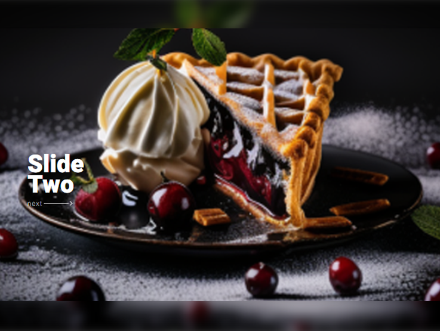

# [Slider with blur](https://lebryere.github.io/Slider-with-blur.git/)

## Browser Support

 |  |  |  |  | 
--- | --- | --- | --- | --- | --- |
94+ ✔ | 92+ ✔ | 89+ ✔ | 82+ ✔ | 87+ ✔ | 55+ ✔ |

## Preview

[](https://lebryere.github.io/Slider-with-blur.git/)

**[View Live Preview](https://lebryere.github.io/Slider-with-blur.git/)**

## Status

[](https://raw.githubusercontent.com/LeBryere/Slider-with-blur.git/master/LICENSE).

## Usage

### Basic Usage

A page showcasing a multi-image slider gallery structured as follows:

- Radio buttons ```html <input type="radio"> ``` are used for switching between images, with each button representing a different image.
- Images are contained within divs with the class slide_img, each of which includes a pair of images along with previous and next buttons.
- Navigation is located within the div with the id nav_slide, which includes dots corresponding to each image ```css <label for="i1" class="dots"> ```.
- Both radio buttons and dots can be used to select the currently displayed image.

This layout enables easy navigation and simple switching between images. Additionally, the SCSS file is downloadable

### Variables
```css
$big_width: 70%; //Slider width - large display
$big_height: 40%; //Slider height - large display
$big_nav_width: 12%; // Previous and Next width - large display
$big_top: 40px;

$small_width: 100%; //Slider width - small display
$small_height: 55%; //Slider height - small display
$small_nav_width: 15%; // Previous and Next width - small display
```

## Copyright and License

Copyright 2024 Lebryere. Code released under the [](https://raw.githubusercontent.com/LeBryere/Slider-with-blur.git/master/LICENSE).
